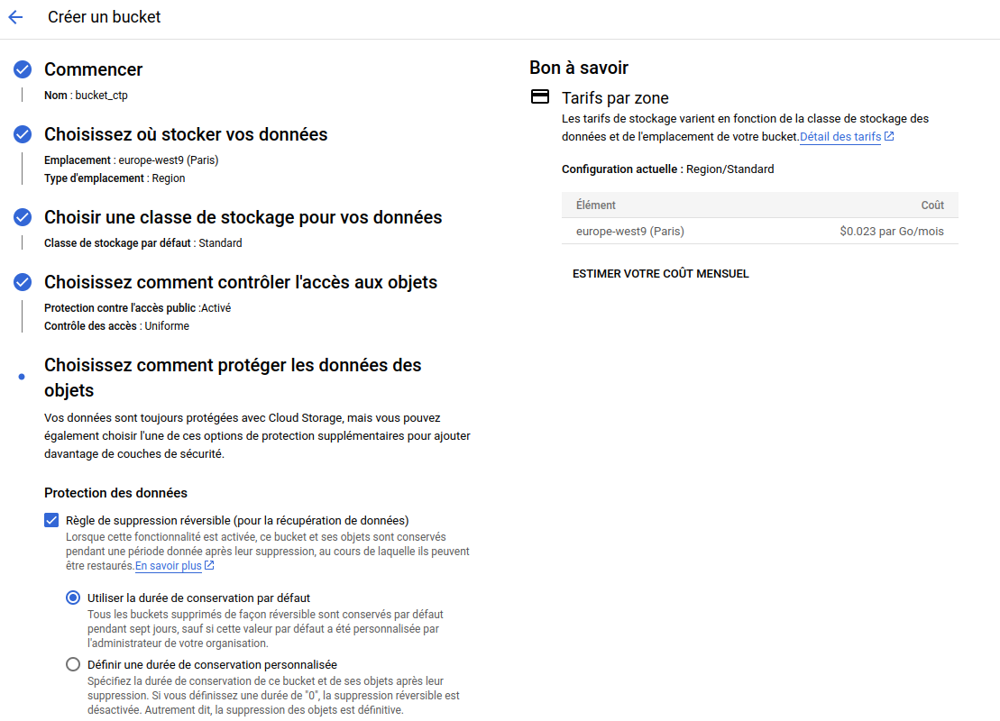
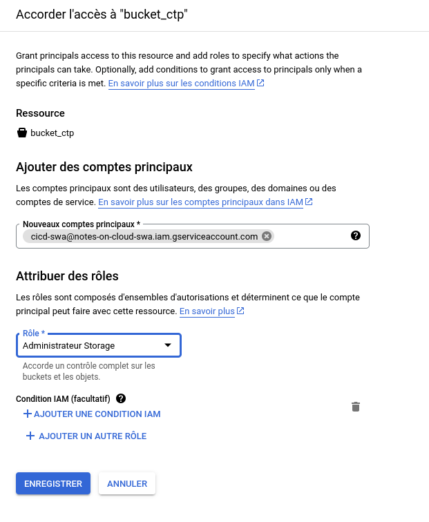
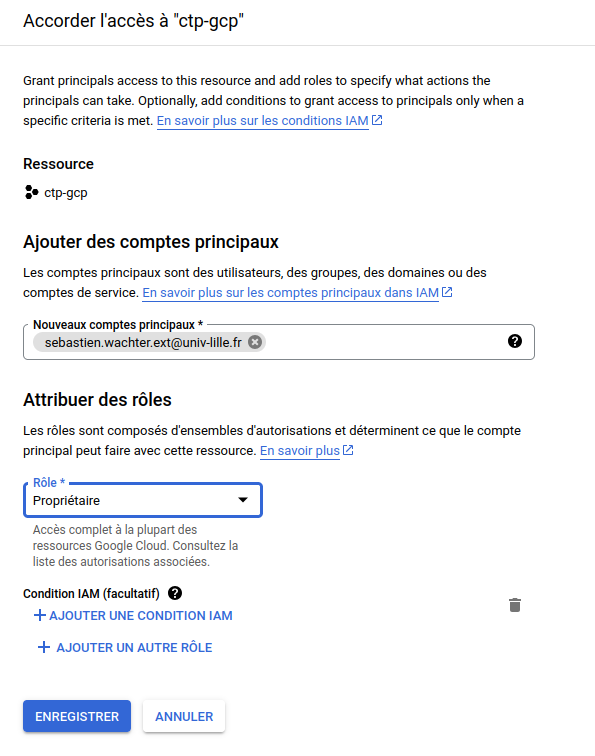
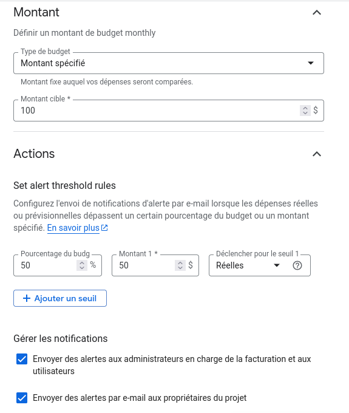
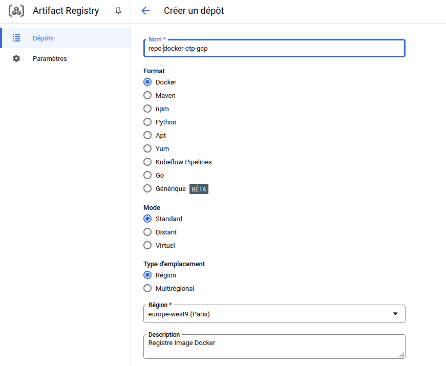
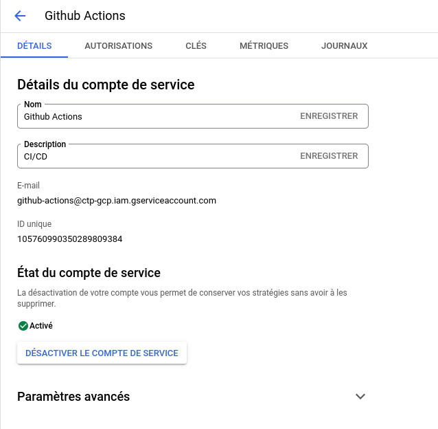

# DS GCP DEBACQ Arthur

## Question ouvertes

### **Décrivez les étapes pour créer un Service Account dans GCP. Quelles sont les bonnes pratiques à suivre en matière de gestion des clés et de sécurité ?**

La création d'un compte de service est possible grâce à la commande suivante via le CLI (il faut s'authentifier avant avec `gcloud auth login` ou `gcloud init`): 

```bash
gcloud iam service-accounts create [SERVICE_ACCOUNT_NAME] --description="[DESCRIPTION]" --display-name="[DISPLAY_NAME]"
```

- [SERVICE_ACCOUNT_NAME] le nom unique de votre compte de service.
- [DESCRIPTION] une description facultative.
- [DISPLAY_NAME] un nom lisible pour le compte.

Ensuite on peut lui ajouter des rôles qui lui permetteront d'accèder, de modifier, d'éxecuter certaines ressources via la commande :

```bash
gcloud projects add-iam-policy-binding [PROJECT_ID] --member="serviceAccount:[SERVICE_ACCOUNT_NAME]@[PROJECT_ID].iam.gserviceaccount.com" --role="[ROLE]"
```

Pour la gestion des clés JSON vu qu'elle contient une clé privé il faut que seul l'utilisateur est les droits de lecture et écriture dessus (chmod 600), de plus il ne faut pas pousser sur github,gitlab la clé. 

### **Comment créer un bucket sur Google Cloud Storage ? Précisez les configurations importantes à définir (localisation, politique de conservation, etc.) et comment celles-ci impactent la sécurité et la performance.**  

La création d’un bucket se fait avec :  

```bash
gcloud storage buckets create gs://NOM_BUCKET --location=REGION --retention-period=DURATION
``` 
- Localisation (`--location`) : La localisation affecte la latence d'accès et d'écriture sur le bucket, plus un bucket est situé loin plus la latence sera élevé.  
- Politique de conservation (`--retention-period`) : Cela empêche la suppression prématurée des objets.  

### **Gestion des identités et des accès (IAM) sur GCP**  

IAM contrôle qui peut accéder aux ressources. Exemple pour limiter l’accès à un bucket :

```bash
gcloud storage buckets add-iam-policy-binding NOM_BUCKET --member="user:email@example.com" --role="roles/storage.objectViewer"
```
Cela donne un accès en lecture seule au bucket à un utilisateur spécifique.  

### **Configuration de la facturation et précautions**  
- Activer la **budgétisation et les alertes** via **Billing → Budgets & alertes** dans le menu Facturation.  
- Utiliser **les quotas et limites** pour éviter les surconsommations.  
- Surveiller les coûts en activant **les rapports de facturation** et en définissant des **règles d’arrêt automatique** pour les VM inutilisées.  
- Activer les alertes par **email** ainsi que les **pubsub** pour être notifier en cas de débordement.

### **Quelle est la chose importante que l'on dit à la fin du cours en quittant la salle de TP ?**

Au revoir et bonne journée :)

## TP

### **Repository Github**

Le lien du repo github :

[https://github.com/artuthur/ctp-gcp](https://github.com/artuthur/ctp-gcp)

### **Application**

La documentation de l'application est disponible via le fichier [README.md](README.md).

### **Bucket**

Pour créer le bucket, je le crée via l'interface web en le nommant **bucket_ctp** et en précisant la localisation en **europe-west9**, c'est à dire à Paris.



### **Autorisation du Service Account**

Afin d'autoriser le SA **cicd-swa@notes-on-cloud-swa.iam.gserviceaccount.com** à pouvoir écrire sur notre bucket nous allons lui accoder l'accès en lui donnant le rôle **Administrateur Storage** dans le menu Cloud Storage.



### **Autorisation IAM**

De même pour le compte **sebastien.wachter.ext@univ-lille.fr** doit pouvoir consulter uniquement notre projet complet, nous allons lui accorder les accès Propriétaire (accès complet) via le menu IAM de GCP.



### **Création d'alertes**

Pour créer une alerte comme dit précedemment, il faut se rendre dans le menu **Facturation** et dans **Budget & alertes**. Nous devons créer un budget pour notre projet afin de créer des alertes par la suite, il n'est pas indiqué de somme dans le sujet donc j'ai pris l'initiative de mettre 100$ et ainsi qu'un alerte pour 50$ avec des envoie d'email lorsque l'alertes est trigger. 



On retrouve bien notre budget pour notre projet avec une alerte lorsque l'on dépasse 50$ (50% vu que notre le montant cible est de 100$, j'aurais pu mettre un autre montant et changer l'alerte aucun soucis). 


### **CI/CD**

Pour mettre en place le CICD je crée un répertoire `.github` ainsi qu'un répertoire `workflow` en son sein avec un fichier CI/CD en format **YAML**.

```bash
mkdir .github
mkdir .github/workflows
touch .github/workflows/cicd.yml
```

Puis on met en place l'intégration CI/CD avec le build de l'image, le push de l'image, le déploiement de celle-ci et le stockage du DockerFile dans le Bucket.

On crée un **artifact registry** pour pouvoir accueuillir les images Docker :



On crée ensuite un **compte de service** pour le **Github Actions** avec les rôles suivant : **Administrateur Storage** pour manipuler le bucket, **Administrateur Cloud Run** pour le déploiement ainsi que **Administrateur Artifacts Registry** afin de lui permettre de manipuler le registre Docker.



Ensuite on crée la **clé de compte (JSON)** de service pour ce compte en prenant garde à ne **pas la pousser sur Github** et a mettre les droits de lecture et ecriture uniquement pour l'utilisateur puis sur Github on l'**ajoute dans les secrets** de notre dépôt via le menu **Settings** et **Secrets and variables**.

